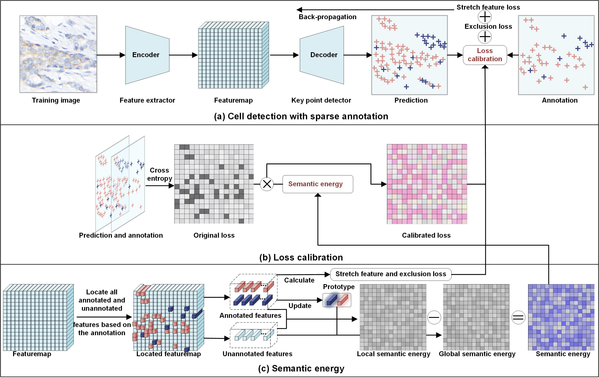

# Prototype-Calibrated-Loss-Framework

This repository provides the official PyTorch implementation for the paper:

**Prototype-Calibrated Loss for Multi-Class Cell Detection in Histological Images with Sparse Annotations**

## Introduction
In this work, we introduce a novel training paradigm tailored for robust multi-class cell detection in histological images under sparse annotation settings. While traditional fully supervised approaches demand exhaustive cell-level labels—an impractical requirement due to the high cellular density and diversity in such images—our framework overcomes this challenge through prototype-guided calibration.

We propose a **Prototype-Calibrated Loss**, which leverages representative annotated features to recalibrate the loss contributions from unannotated regions. By computing a **Semantic Energy (SE)** that measures the affinity between unannotated and annotated cell features, we dynamically weight the training loss to mitigate label noise and incorrect supervision.

To further enhance feature discrimination between cell classes, we introduce two auxiliary losses:
- **Stretch Feature Loss (SFL):** Encourages greater inter-class separability by magnifying subtle feature differences.
- **Exclusive Loss (EL):** Penalizes uncertain predictions and reinforces class exclusivity.

Comprehensive evaluations on three benchmark datasets show that our method not only outperforms state-of-the-art techniques designed for sparse annotations but also consistently surpasses fully supervised baselines—across all annotation ratios. Even when trained with only 10% of the annotations, our model demonstrates superior generalization across diverse cell types, highlighting its clinical relevance in reducing annotation burdens.



---

## Dependencies

This implementation is based on the following key package:

- `torch==1.7.1`
Please refer to the `requirements.txt` file for the complete list of dependencies.
---

## Usage

### Data Preparation

To begin training, you need to organize the dataset (training images and corresponding ground truth annotations).  
Please refer to the script [`data_preprocess_heatmap.py`](./data_preprocess_heatmap.py) for data preprocessing guidelines.

### Model Training and Evaluation

- **Training**  
  Configure the training parameters as needed, then execute the following command:  
  ```bash
  python train.py
- **Evaluation**  
  Configure the evaluation parameters as needed, then execute the following command:  
  ```bash
  python test.py
